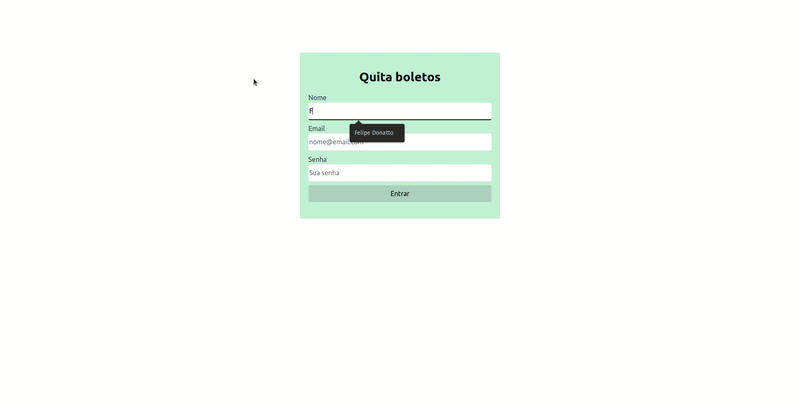

# Projeto Quita-Boletos

Projeto foi criado com [Create React App](https://github.com/facebook/create-react-app).

Uma aplicação simples com um fluxo de login, salvando os dados do usuário no localstorage. Após o login o usuario poderá criar, apagar e editar pagamentos feitos.

## Tópicos

    
<strong>💻 Para começar</strong>

    1. Clone o repositório

- Use o comando: `git clone git@github.com:FelipeDonatto/Quita_Boletos.git`

- Entre na pasta do repositório que você acabou de clonar:

  - `cd Quita_Boletos`

3.  Instale as dependências

- `npm install`

4.  Para rodar a aplicação

- `npm start`

    
<strong>👨🏻‍💻 Técnologias utilizadas</strong>

<ul>
    <li>
     Typescript
    </li>
    <li>
     Tailwind CSS
    </li>    
    <li>
     React com template typescript
    </li>    
    <li>
     React hooks (state e context)
    </li>
    <li>
     Renposividade através de desenvolvimento mobile-first
    </li>
</ul>

    
<strong>👷 Plano de melhoria</strong>

<ol>
    <li>
     Mudar o método de salvar os dados, fazendo uso de um bando de dados SQl.
    </li>
    <li>
     Integração com backend
    </li>    
    <li>
     Login com dados encriptados por JWT ou alguma verificação semelhante, além de integrar com banco de dados.
    </li>
</ol>

